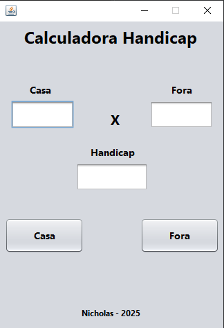

# Calculadora Handicap 

Este é um projeto Java que implementa uma calculadora de handicap para usuários que possuem dúvidas de como calcular o resultado final.

## 📱 Demonstração

Interface gráfica:

## ☕ Funcionalidades

* Cálculo de handicap: O programa recebe os valores de "Casa", "Fora" e "Handicap" e realiza o cálculo para determinar o resultado da partida.
* Interface gráfica: O programa possui uma interface gráfica simples e intuitiva, que facilita a interação do usuário com a calculadora.
* Resultado: O programa exibe o resultado da partida, informando se o apostador "Venceu" ou "Perdeu".

## 💻 Como usar

1. Clone este repositório.
2. Abra o projeto na IDE de sua preferência.
3. Execute o arquivo `displayHandicap.java`.
4. Insira os valores de "Casa", "Fora" e "Handicap" nos campos correspondentes.
5. Clique no botão "Casa" ou "Fora" para realizar o cálculo.
6. O resultado será exibido na tela.

## 🛠 Tecnologias utilizadas

* Java
* Swing (para a interface gráfica)
* NetBeans (ambiente de desenvolvimento)

## 🔍 Observações

* Este programa foi desenvolvido como um exemplo simples de calculadora de handicap e pode ser aprimorado com funcionalidades adicionais, como a inclusão de mais opções de cálculo e a exibição de informações detalhadas sobre a partida.
* O código fonte está comentado para facilitar a compreensão do funcionamento do programa.

## 👨‍💻 Autor

* Nicholas Monteiro - @NickDevD

## 📚 Licença

Este projeto está sob a licença Apache. Para mais informações, consulte o arquivo LICENSE.

Sinta-se à vontade para modificar e distribuir este código como desejar.

## ✉ Contato

Em caso de dúvidas ou sugestões, pode entrar em contato por meio das redes que constam no meu perfil👩🏾‍💻.
